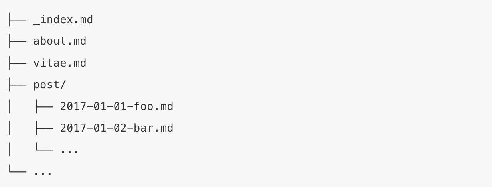

```{r setup, include=FALSE}
options(htmltools.dir.version = FALSE)
knitr::opts_chunk$set(warning = FALSE, message = FALSE, 
  comment = NA, dpi = 300)
library(magick)
library(tidyverse)
library(countdown)
```

class: title-slide, top, left
background-image: url(images/hugoCover.jpeg)
background-position: top

# `r rmarkdown::metadata$title`

### `r rmarkdown::metadata$author`


.footnote[
All content is [RStudio Education](https://github.com/rstudio-education/), CC-BY. 
]


---
class: inverse, middle, center

# What is blogdown?

An <i class="fab fa-r-project"></i> package...

--

that lets you create websites in 


---
class: center, middle

```{r out.width="90%", echo = FALSE}
knitr::include_graphics("assets/bonus.jpg")
```


# .shout[You can use R Markdown!]


---
background-image: url(assets/amber.png)
background-size: contain

---
background-image: url(assets/openscapes.png)
background-size: contain

---
background-image: url(assets/earo.png)
background-size: contain

---
background-image: url(assets/malcolm.png)
background-size: contain

---
background-image: url(assets/alison.png)
background-size: contain
  
---
background-image: url(assets/emi-showcase.gif)
background-size: cover


##### NEED TO ADD STEPS HERE 

---

# This is a Hugo site

```{r out.width="90%", echo = FALSE}
knitr::include_graphics("images/folder-structure.png")
```

---

# This is the content folder

.pull-left[
```{r out.width="90%", echo = FALSE}

```
]

.pull-right[

+ Hugo calls these "sections"
+ Every section has a "page" (usually singular)

]


---

# This is the home folder

.pull-left[
In the academic theme, these are *widgets*:

+ Portable! Move the `widget.md` file to any other [page](https://sourcethemes.com/academic/docs/managing-content/#create-a-widget-page)
+ Configurable! Think: Mr. Potato Head

]

.pull-right[

```{r echo = FALSE}
fs::dir_tree(path = "/Users/alison/rsites/kellykapowski/content/home", recurse = FALSE, all = TRUE)
```

]

---
class: inverse, middle, center

# Widgets


---
class: inverse, middle, center

# Edit your home page

Pick your widgets- I suggest leaving them all in place but setting `active = FALSE` to remove any.


If you delete, they are always in: `themes/hugo-academic/exampleSite/content/home`

```{r echo = FALSE}
countdown(minutes = 5, play_sound = TRUE)
```


Bonus: move a widget to another [page](https://sourcethemes.com/academic/docs/managing-content/#create-a-widget-page). You could, for example, have the `about.md` widget be the **only** active widget on the home page.

# Go Deeper

Read more of the [docs](https://sourcethemes.com/academic/docs/page-builder/#personalizing-widgets) for personalizing widgets.


---
class: inverse, middle, center

# `r emo::ji("sparkles")` Quiz! `r emo::ji("sparkles")`

```{r echo = FALSE}
countdown(minutes = 2, play_sound = TRUE)
```

What happens if you edit `public/` directly, or delete the folder altogether, then serve the site again? 


Hint: try it! `r emo::ji("fire")`


---
class: inverse, middle, center

# `r emo::ji("sparkles")` Trick question `r emo::ji("sparkles")`

```{r echo = FALSE}
countdown(minutes = 0, seconds = 15, play_sound = TRUE)
```

Should you ever edit files in the `public/` directory?


