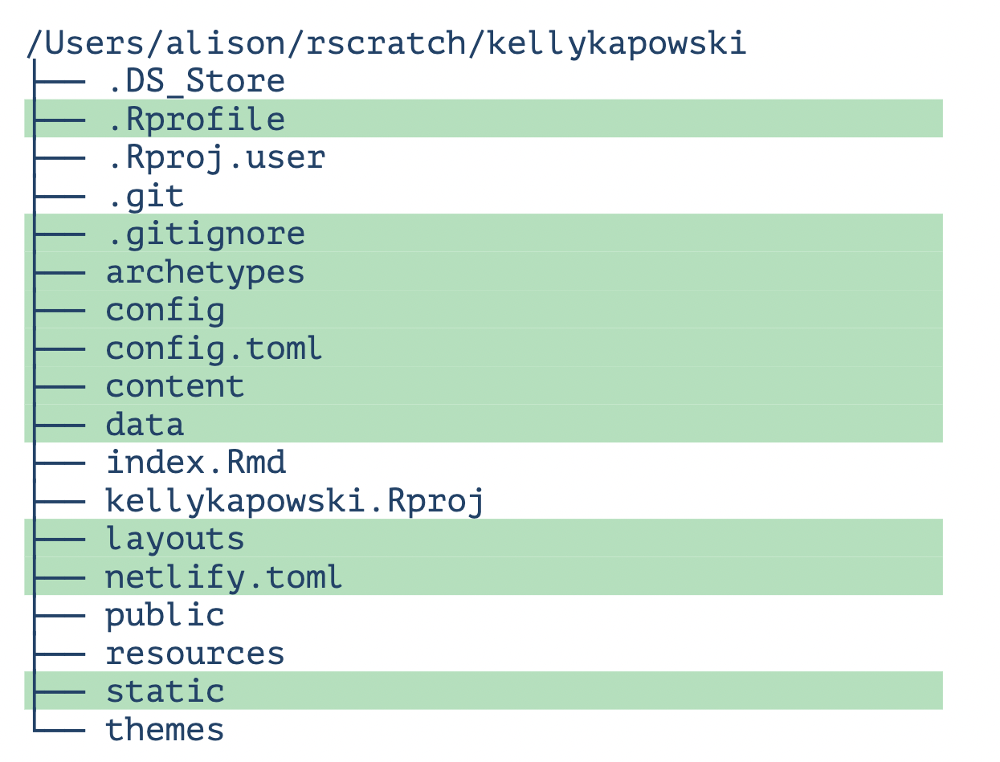

```{r setup, include=FALSE}
options(htmltools.dir.version = FALSE)
knitr::opts_chunk$set(warning = FALSE, message = FALSE, 
  comment = NA, dpi = 100)
library(magick)
library(tidyverse)
library(countdown)
```

class: title-slide, top, left
background-image: url(images/hugoCover.jpeg)
background-position: top

# `r rmarkdown::metadata$title`

### `r rmarkdown::metadata$author`


.footnote[
All content is [RStudio Education](https://github.com/rstudio-education/), CC-BY. 
]


---
class: inverse, middle, center

# What is blogdown?

An <i class="fab fa-r-project"></i> package...


that lets you create websites in 


---
class: center, middle

```{r out.width="90%", echo = FALSE}
knitr::include_graphics("assets/bonus.jpg")
```


# .shout[You can use R Markdown!]


---
background-image: url(assets/amber.png)
background-size: contain

---
background-image: url(assets/openscapes.png)
background-size: contain

---
background-image: url(assets/earo.png)
background-size: contain

---
background-image: url(assets/malcolm.png)
background-size: contain

---
background-image: url(assets/alison.png)
background-size: contain
  
---
background-image: url(assets/emi-showcase.gif)
background-size: cover


---
class: inverse, middle, center

# `r emo::ji("sparkles")` Ready, Set, Goal `r emo::ji("sparkles")`

## Users already have an existing repo on GitHub and want to add a .Rmd hosted Hugo themed website to the directory 


---
class: inverse
# Step 1 

- Fork `https://github.com/hidyverse/RMD4HS`

- Clone with RStudio `New Project` from version control 

```{r echo = F}
knitr::include_graphics("images/git-cycle.png")
```

---
class: inverse
# Step 2 

Create directories within project root 

```{r eval=F}
dir.create("website")
dir.create("docs")
```

---
class: inverse
# Step 3

Create `.noyekyll` file within the new `docs/` directory


```{r eval = F}
file.create('docs/.nojekyll')
```


This will stop GitHub from being confused later that we're using Hugo (GitHub typically expects Jekyll)

```{r eval=F}
ls -a doc/
```

**HINT**: Use above to double check your `.nojekyll` file was made or turn on `show hidden files` within `more` in the `files` browser in RStudio  

---
class: inverse, middle
# Step 4

Prep GitHub repo for Pages documents 

- Go to `Settings` in your github repo 
- Select `Pages` on the guide on the left of the screen
- Change `Branch` from none to `main` (or `master`) 
- Change repo from root to `docs/`
- Save & Refresh
- Copy the url made for your repo
Optional: Return to your main repo page and add the new url to the `about` section at the right to make your life easier later

---
class: inverse
# Step 5

Navigate into the `website/` directory

```{r eval=F}
setwd("website/")
```

We will be copying the `website/public/` to `docs/` and pushing `docs/` to GitHub when we're ready.  

---
class: inverse
# Step 6

Create a blogdown website! 

```{r eval =F}
install.packages("blogdown")
blogdown::new_site()
```

**HINT**: Cloud users need to say no to rendering the site and add 
```{r eval = F}
relativeURLs: true
```
to their `config` file prior to viewing a rendered site (**and use the `serve_site()` addin**)! 

---

## This is a Hugo site

```{r out.width="90%", echo = FALSE}
knitr::include_graphics("images/folder-structure.png")
```


---
class: inverse
# Step 7

Change base url in `config.yaml` to new github pages url 

Paste the url in `config.yaml` as the key to the `baseurl` value

---
class: inverse
# Step 8

Add `website/` to `.gitignore` 

Create (or add to an existing `.gitignore`) in the root project. Include all the website materials in the `.gitignore` for now. We don't need to have our website creation materials be public, just the final posts.

---
class: inverse
# Step 9

prior to pushing to GitHub you'll need to build your site
```{r eval= F}
`blogdown::build_site()`
```


Building the site will fill out the `public/` directory with files from your content within `website/` which we want to copy to `root_project/docs/` to push to GitHub. 

---
background-image: url(assets/hugo/1.png)
background-size: cover

---
background-image: url(assets/hugo/2.png)
background-size: cover

---
background-image: url(assets/hugo/3.png)
background-size: cover

---
background-image: url(assets/hugo/4.png)
background-size: cover

---
background-image: url(assets/hugo/5.png)
background-size: cover

---
background-image: url(assets/hugo/6.png)
background-size: cover

---
background-image: url(assets/hugo/7.png)
background-size: cover

---
background-image: url(assets/hugo/8.png)
background-size: cover

---
background-image: url(assets/hugo/9.png)
background-size: cover

---
background-image: url(assets/hugo/10.png)
background-size: cover

---
background-image: url(assets/hugo/11.png)
background-size: cover

---
background-image: url(assets/hugo/12.png)
background-size: cover


---
class: inverse
# Step 10

Copy contents of new `public/` folder to `../docs/` 

This is a manual process so I doubt this is the most efficient way, but this works! 


```{bash eval=F}
cp -r website/public/* docs/
```
**NOTE**: I used the terminal for this! 

---
class: inverse
# Step 11

Push to existing GitHub repo (or some other upload)

Does `docs/` show up in your changes? 

**HINT**: If you're on the cloud, you need to first tell Git who you are! Try:
```{bash eval=F}
git config --global user.email "you@example.com"
git config --global user.name "UserName"
```
**NOTE**: I used the terminal for this!   


---
class: inverse, middle, center

# `r emo::ji("sparkles")` Quiz! `r emo::ji("sparkles")`

```{r echo = FALSE}
countdown(minutes = 2, play_sound = TRUE)
```

What happens if you edit `public/` directly, or delete the folder altogether, then serve the site again? 


Hint: try it! `r emo::ji("fire")`


---
class: inverse, middle, center

# `r emo::ji("sparkles")` Trick question `r emo::ji("sparkles")`

```{r echo = FALSE}
countdown(minutes = 0, seconds = 15, play_sound = TRUE)
```

Should you ever edit files in the `public/` directory?

---

# Hugo help

Self learning from a much better teacher than myself: Alison Hill 
https://www.apreshill.com/blog/spoonful-hugo/ 

```{r echo = F}
knitr::include_graphics("images/spoonful-hugo.png",dpi = 200)
```


---

# What to touch

Green means go!

.pull-left[

```{r echo =F}

```
]

.pull-right[
All of your `themes` folder can be overriden by files in your project root: [read more here](https://zwbetz.com/override-a-hugo-theme/)

]

---
class: inverse, middle
# Your turn 

- Download new theme and update as desired! 
  - [A complete list of Hugo themes](https://themes.gohugo.io/)  
  - [More common (aka more likely to work) Hugo themes via    Wowchemy](https://wowchemy.com/hugo-themes/)
- Update your content! 
  - Check out the [wowchemy docs](https://wowchemy.com/docs/getting-started/customization/) for non-programmer instructions
- Familiarize yourself with `config` files
  - The [blogdown](https://bookdown.org/yihui/blogdown/configuration.html) book is a great place to start! 
  
  

