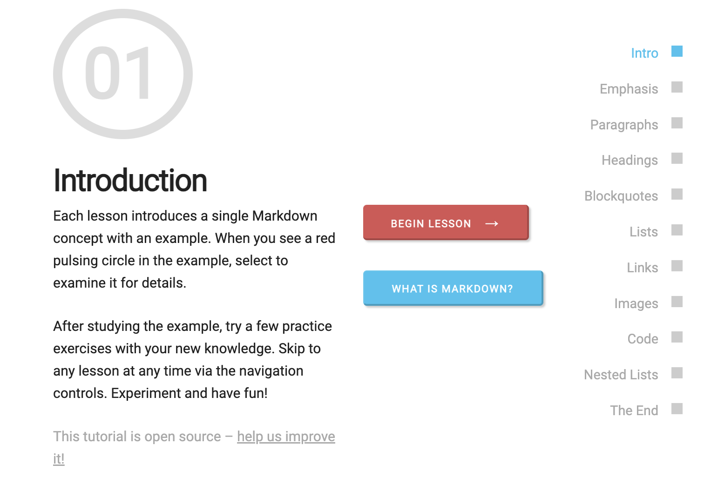

```{r setup, include=FALSE}
options(htmltools.dir.version = FALSE)
episode_counter <- 0
knitr::opts_chunk$set(
  collapse = TRUE,   
  comment = "#>"
)
```

```{r packages, include=FALSE}

library(arsenal)
library(countdown)
library(gt)
library(janitor)
library(knitr)
library(survival)
library(tidyverse)
library(ymlthis)


ggplot2::theme_set(ggplot2::theme_minimal())
```

```{r load-data, include=FALSE}
mockdata = lung %>% 
  mutate_at(.vars = c("inst", "status", "sex", "ph.ecog"),.funs = as.factor)
```


class: title-slide, center, bottom

## `r rmarkdown::metadata$title`
  
.pull-left[
#### `r rmarkdown::metadata$author` &#183; Data Science Institute

######  All content is [RStudio Education](https://github.com/rstudio-education/rmd4medicine), CC-BY. All art (unless otherwise noted) is by [Desirée De Leon](https://desiree.rbind.io/) and [Allison Horst](https://www.allisonhorst.com/), CC-BY-NC-ND.
]


---

```{r child="what-is-rmd.Rmd"}

```

---

.left-column[
<span class="fa-stack fa-4x">
  <i class="fa fa-circle fa-stack-2x" style="color: #2f5275;"></i>
  <strong class="fa-stack-1x" style="color: #fff;">?</strong>
</span> 
]

.right-column[

# What is R Markdown?

1. ["An authoring framework for data science."](https://rmarkdown.rstudio.com/lesson-1.html) (`r emo::ji("heavy_check_mark")`)

1. [A document format (`.Rmd`).](https://bookdown.org/yihui/rmarkdown/) (`r emo::ji("heavy_check_mark")`)

1. [An R package named `rmarkdown`.](https://rmarkdown.rstudio.com/docs/) (`r emo::ji("heavy_check_mark")`)

1. ["A file format for making dynamic documents with R."](https://rmarkdown.rstudio.com/articles_intro.html) (`r emo::ji("heavy_check_mark")`)

1. ["A tool for integrating text, code, and results."](https://r4ds.had.co.nz/communicate-intro.html) (`r emo::ji("heavy_check_mark")`)

1. ["A computational document."](http://radar.oreilly.com/2011/07/wolframs-computational-documen.html) (`r emo::ji("heavy_check_mark")`)

1. Wizardry. (`r emo::ji("witch")`)

]


---

```{r child="how-rmd-works.Rmd"}

```

---
background-image: url(images/rmd_flowchart.png)

# How *does* R Markdown work?

???

1. `r emo::ji("shrug")` (`r emo::ji("heavy_check_mark")`)

1. ["I press knit, a document appears, and I believe that anything happening in between could be actual magic."](https://twitter.com/allison_horst/status/1070323369600442368?s=20) (`r emo::ji("wizard")`)

1. `knitr` executes the code and converts `.Rmd` to `.md`; **Pandoc** renders the `.md` file to the output format you want. (`r emo::ji("heavy_check_mark")`)


---
class: middle, center

# Change your mental model

.pull-left1[

### Source &harr; output

```{r echo=FALSE, out.width="50%"}
knitr::include_graphics("images/word.png")
```

]

.pull-right1[

### Source &rarr; output

```{r echo=FALSE, out.width="50%"}
knitr::include_graphics("images/rmd-file.png")
```

]

---
class: middle, center

# Change your mental model

.pull-left1[

### Source &harr; output

```{r echo=FALSE, out.width="50%"}
knitr::include_graphics("images/haba-elise.jpg")
```

]

.pull-right1[

### Source &rarr; output

```{r echo=FALSE, out.width="50%"}
knitr::include_graphics("images/doll.png")
```

]


---
background-image: url(images/welliewishers/Slide2.png)
background-size: cover
class: top, center

.footnote[https://www.americangirl.com/shop/c/welliewishers]

---
class: middle, inverse, center

# Same ~~doll~~ source

# Different occasions


---
class: your-turn

# First look

Explore `01-explore.Rmd`. 
Look at the source, then `r emo::ji("yarn")` **Knit** to HTML.

Try to identify these parts in the source and the output:

1. The **metadata**

1. The **text** 

1. The **code**

1. The **output**

**If this was easy**, try to identify global chunk options!


```{r echo = FALSE}
countdown(minutes = 2)
```


---
class: center, middle

```{r do-live, echo=FALSE, out.width="90%"}
knitr::include_graphics("images/doc-live.jpg")
```


---
class: middle, center, inverse

<span class="fa-stack fa-4x">
  <i class="fa fa-circle fa-stack-2x" style="color: #fff;"></i>
  <strong class="fa-stack-1x" style="color:#2f5275;">`r (episode_counter <- episode_counter + 1)` </strong>
</span> 

# Metadata

---

# metadata: YAML

.pull-left1[

_"YAML Ain't Markup Language"_


```yaml
---
key: value
---
```

]

.pull-right1[

```{r echo=FALSE, out.width="75%", fig.align='center'}
knitr::include_graphics("images/orchestra.jpg")
```

]


---

# Save output options in your YAML

.pull-left1[

```{r echo = FALSE}
yml_empty() %>% 
  yml_output(html_document()) %>% 
  asis_yaml_output()
```

```{r echo = FALSE}
yml_empty() %>% 
  yml_output(html_document(toc = TRUE)) %>% 
  asis_yaml_output()
```


]

.pull-right1[

```{r echo=FALSE, out.width="75%", fig.align='center'}
knitr::include_graphics("images/orchestra.jpg")
```

]

---
class: your-turn

# Your turn

## Edit your YAML

Use **`?html_document`** from your R console to:

1. Add a floating table of contents

1. Add a theme

1. Use the "kable" method to print data frames (more on this later!) 

`r emo::ji("yarn")` **Knit** to HTML to see the output.

**If this was easy**, try to embed the `Rmd` source code to download.

_psst...answers on the next slide..._

```{r echo = FALSE}
countdown(minutes = 2)
```

---
class: your-turn

# Answers

```{r echo = FALSE}
yml_empty() %>% 
  yml_output(html_document(toc = TRUE,
                           toc_float = TRUE,
                           theme = "flatly",
                           df_print = "kable",
                           code_download = TRUE)) %>% 
  asis_yaml_output()
```
---

# What is hard about YAML?

.pull-left1[
+ Indentations matter

+ Rarely informative error messages

+ Knowing which output options are relevant for different formats (i.e., Word, PDF, HTML, etc.)

+ Easy to forget the right `key`

+ Easy to forget the possible `values` for a given `key`
]

---
class: inverse, center, middle

<span class="fa-stack fa-4x">
  <i class="fa fa-circle fa-stack-2x" style="color: #fff;"></i>
  <strong class="fa-stack-1x" style="color:#2f5275;">`r (episode_counter <- episode_counter + 1)` </strong>
</span> 

# Markdown Text

---
name: 03-formative
class: middle

# Pop quiz

--

.pull-left1[

How do you add lists in Markdown? Bulleted? Numbered?

`! Item 1`

`- Item 1`

`# Item 1`

`1. Item 1`

]

--

.pull-right1[

```{r echo=FALSE, out.width="95%", fig.align='left'}

```
https://commonmark.org/help/tutorial/
]

---
class: inverse, center, middle

<span class="fa-stack fa-4x">
  <i class="fa fa-circle fa-stack-2x" style="color: #fff;"></i>
  <strong class="fa-stack-1x" style="color:#2f5275;">`r (episode_counter <- episode_counter + 1)` </strong>
</span> 

# <i class="fab fa-r-project"></i> code

---

# Code chunks

.pull-left1[

````
```{r}`r ''`
mockdata %>% 
  distinct(status)
```
````

What is the fate of this chunk?

]

--

.pull-right1[

```{r}
mockdata %>% 
  distinct(status)
```

]

---

# Code chunks

.pull-left1[

````
```{r}`r ''`
n_sites <- n_distinct(mockdata$inst)
```
````

What fate do you predict here?

]

--

.pull-right1[

```{r}
n_sites <- n_distinct(mockdata$inst)
```

  
]

---

# Code chunks

.pull-left1[

````
```{r}`r ''`
n_sites <- n_distinct(mockdata$inst)
n_sites
```
````

]

--

.pull-right1[

```{r}
n_sites <- n_distinct(mockdata$inst)
n_sites
```

  
]

---

# Code chunks

.pull-left1[

````
```{r}`r ''`
ggplot(mockdata, aes(x = status, 
                     fill = status)) +
  geom_bar()
```
````

What about this one?

]

--

.pull-right1[

```{r fig.retina=3, out.width="70%", fig.align='center'}
ggplot(mockdata, aes(x = status, 
                     fill = status)) +
  geom_bar()
```

]

---

# Add chunks

button or

Command (or Cmd) `⌘` + Option (or Alt) `⌥` +  `i` (Mac)

Ctrl + Alt + `i` (Windows/Linux)

--

# Run chunks


interactively (show button)  

whole doc (knit button or run all chunks)


---
class: inverse, center, middle

<span class="fa-stack fa-4x">
  <i class="fa fa-circle fa-stack-2x" style="color: #fff;"></i>
  <strong class="fa-stack-1x" style="color:#2f5275;">`r (episode_counter <- episode_counter + 1)` </strong>
</span> 

# Output

---

# Chunk options

.pull-left1[

````
```{r}`r ''`
glimpse(mockdata)
```
````

]

.pull-right1[

```{r}
glimpse(mockdata)
```

]

---

# echo

.pull-left1[

````
```{r echo=FALSE}`r ''`
glimpse(mockdata)
```
````

]

.pull-right1[

```{r echo=FALSE}
glimpse(mockdata)
```

]

---

# eval

.pull-left1[

````
```{r eval=FALSE}`r ''`
glimpse(mockdata)
```
````

]

.pull-right1[

```{r eval=FALSE}
glimpse(mockdata)
```

]

---

# include

.pull-left1[

````
```{r include=FALSE}`r ''`
glimpse(mockdata)
```
````

]

.pull-right1[

```{r include=FALSE}
glimpse(mockdata)
```

]

---

# Chunk options

.pull-left1[

````
```{r echo=TRUE, results='hide'}`r ''`
glimpse(mockdata)
```
````
+ Place between curly braces<br>`{r option=value}`

+ Multiple options separated by commas<br>`{r option1=value, option2=value}`

+ Careful! The `r` part is the **code engine** (other engines possible)
]

.pull-right1[

```{r echo=TRUE, results='hide'}
glimpse(mockdata)
```

]


---
class: center
background-image: url(https://pbs.twimg.com/media/EXm5IN8UwAADiRQ?format=jpg&name=4096x4096)
background-size: cover

.pull-right1[

### Use other code engines! 

]

---

.left-column[
# Default options
]

.right-column[
```{r out.width="90%"}
str(knitr::opts_chunk$get())
```

]

---

# Chunk labels

.pull-left1[

````
```{r peek, echo=FALSE, results='hide'}`r ''`
glimpse(mockdata)
```
````
+ Place between curly braces<br>`{r label}`

+ Separated options with commas<br>`{r label, option1=value}`

+ Careful! No duplicate chunk labels

]

.pull-right1[

    ````
    ```{r peek}`r ''`
    head(mockdata)
    ```
    ````

    ```
    Error in parse_block(g[-1], g[1], params.src) : 
      duplicate label 'peek'
    Calls: <Anonymous> ... process_file -> split_file -> lapply -> FUN -> parse_block
    Execution halted
    ```

]


---
class: middle, center

# A good chunk label

.pull-left[

### Good

`myplot`

`my-plot`

`myPlot`

`myplot1`

]

.pull-right[

### Bad

`my_plot`

`my plot`

everything else!

]

---
background-image: url(images/pour.jpeg)
background-position: left
background-size: contain
class: middle, center

.pull-right[

]

---

# The setup chunk


.pull-left1[

````
```{r setup, include=FALSE}`r ''`
knitr::opts_chunk$set(
  collapse = TRUE,   
  comment = "#>", 
  out.width = "100%" 
)
```
````

]

.pull-right1[

+ A special chunk label: `setup`

+ Typically the first chunk

+ All following chunks will use these options (i.e., sets global chunk options)

+ **Tip**: set `include=FALSE`

+ You can (and should) use individual chunk options too

]

---
class: your-turn

# Your turn

## New data dump! `r emo::ji("newspaper")`

Data from more sites just came in &mdash; we now have data for 18 study sites and need to update our report.

1. Replace `2022-01-01_lungdat.csv` with `2022-02-22_lungdat.csv` in the file `01-explore.Rmd`. 

1. `r emo::ji("yarn")` **Knit** to HTML. Do you see data for all sites?

**If this was easy**, try outputting to Microsoft Word Document format!

```{r echo = FALSE}
countdown(minutes = 2)
```

---
class: middle, center


```{r echo=FALSE, out.width="40%", fig.link="https://rmarkdown.rstudio.com/docs/reference/index.html#section-output-formats"}
knitr::include_graphics("images/rmdbase-formats.png")
```

https://rmarkdown.rstudio.com/docs/reference/index.html#section-output-formats


---
class: middle, center, inverse

<span class="fa-stack fa-4x">
  <i class="fa fa-circle fa-stack-2x" style="color: #fff;"></i>
  <strong class="fa-stack-1x" style="color:#2f5275;">!</strong>
</span> 


# Extension Packages

---
background-image: url(images/bookdown.png)
background-size: 10%
background-position: 42% 2%

## Bookdown
.pull-left1[
While writing single reports is quite common, so is also writing book-style reports.  
Book-style reports include chapters, table of contents, appendices etc.    
These are not arbitrary to compile and set up.

Bookdown to the rescue. 
Create lovely books in html, pdf, or even e-book format!

- Yihui Xie's - [Bookdown book on bookdown](https://bookdown.org/yihui/bookdown/)  
]

.pull-right1[
```{r, echo = FALSE, out.width='100%'}
knitr::include_graphics("images/bookdown_ex.png")
```
]

---
background-image: url(images/pagedown.png)
background-size: 10%
background-position: 42% 2%


## Pagedown

.pull-left1[
html documents usually are a single page, that can be scrolled for ever and ever an ever.  
Some times, you'd like to have pages also in html, without needing to do pdf or create an  
entire bookdown book.

Pagedown helps you do this, making really sleek paginated html reports.

Pagedown also has templates for html resumes, business cards and more!

- Yihui Xie's - [Paginated html report of paginated html reports](https://pagedown.rbind.io/)  
]

.pull-right1[
```{r, echo = FALSE, out.height='100%'}
knitr::include_graphics("images/pagedown_ex.png")
```
]

---
background-image: url(images/posterdown.png)
background-size: 10%
background-position: 42% 2%


## Posterdown
.pull-left1[
Posterdown is great for making... posters!
The package is very simple to use if you know rmarkdown already,
and has some nice tempaltes to build on. 

- Brent Thorne's - [Poster of posterdown](https://brentthorne.github.io/posterdown_html_showcase/)

]

.pull-right1[
```{r, echo = FALSE, out.width='100%'}
knitr::include_graphics("images/poster_ex.png")
```
]

---
background-image: url(images/blogdown.png)
background-size: 10%
background-position: 42% 2%


## Blogdown

.pull-left1[

Blogging can be a fun way to disseminate research, data and coding.  
It's a great way to show-case your skills and tell others about the cool things you are learning and figuring out.

- Yihui Xie's - [Blogdown book](https://bookdown.org/yihui/blogdown/) 

]

.pull-right1[
```{r, echo = FALSE, out.width='100%'}
knitr::include_graphics("images/blogdown_ex.png")
```
]

---
background-image: url(images/vitae.png)
background-size: 10%
background-position: 42% 2%

## Vitae
.pull-left1[

Resume's are important, updating them also important but at times tedious.
And finding nice templates for resumes is not easy.

Vitae is a great package to migrate your resume to Rmarkdown and create truly stunning resumes!

- Mitchell O'Hara-Wild's - [Vitae package for resumes](https://pkg.mitchelloharawild.com/vitae/)  
]

.pull-right1[
```{r, echo = FALSE, out.width='100%'}
knitr::include_graphics("https://pbs.twimg.com/media/Dsqo7mdU0AALGEe?format=jpg&name=medium")
```
]


---

# More

+ [`redoc` `r emo::ji("package")`](https://noamross.github.io/redoc/)

+ [`spelling` `r emo::ji("package")`](https://docs.ropensci.org/spelling/)

+ [`wordcountaddin` `r emo::ji("package")`](https://github.com/benmarwick/wordcountaddin)

+ [`pkgdown` `r emo::ji("package")`](https://pkgdown.r-lib.org/)

+ [`officedown` `r emo::ji("package")`](https://davidgohel.github.io/officedown/)

---

# Take-aways


`r emo::ji("heavy_check_mark")` **Document your document:** use YAML to set up meaningful metadata


`r emo::ji("heavy_check_mark")` **Style your document:** use YAML to add options to your chosen output format


`r emo::ji("heavy_check_mark")` **Organize your text:** use markdown headers with `#`


`r emo::ji("heavy_check_mark")` **Organize your code:** use `knitr` chunk labels


`r emo::ji("heavy_check_mark")` **Style your text:** use markdown **bold**, _italics_, <i class="fas fa-list-ul"></i> bullets, and <i class="fas fa-list-ol"></i> lists


`r emo::ji("heavy_check_mark")` **Style your output:** use `knitr` chunk options


`r emo::ji("yarn")` early, `r emo::ji("yarn")` often


---

## Extra tips!
**When naming code chunks, don't use `_` (underscore), but `-` (dash)**   
Some times when converting to pdf the underscore will cause issues  


**When you get latex errors, start stripping down your document untill you find the problem part**  


**Html is easier to render than pdf**  
because you dont need to go through latex...If you can "get away" with html reports do that!


**Customizing html reports is easier than pdf**  


**Lists need _two_ spaces after each element**  
Rmarkdown and markdown will not create a line break (even if text is on different consecutive lines) unless there are _two_ spaces at the end of a line
  - double line break (i.e. consecutive lines have a blank line between them) usually creates a larger line space and is usually not what you are after, so remember the double space at the end


---
class: middle, center

# `r emo::ji("stopwatch")`

# Lecture done!  

### Next, take some time to familiarize yourself with the elements in `02-explore.Rmd`!


